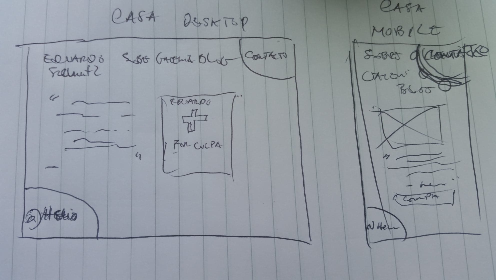

# Build a Blog

>This is a sketch of the _Home/Casa_ blog.  

### Table of Contents 

* Description 
* Technologies
* License 
* Author Info 

---

## Description 

This projects consists of building a blog for an author whose only published book is called **Por Culpa Da Madalena**, with focus on _mobile-first approach_.  Here is the link to the [blog](https://srlhyo.github.io/eduardo-schultz/). Also, it is imporan

For this project, I have used a new technology (JavaScript) that allow the page a pop-up and the users to close it after reading. There are some Javascript libraries that would achieve the same thing a lot quicker, with less code, but it was interesting to right Vanilla Javascript and understand how eache line of code does in order to get to the solution. 

This time, I have not only commented out and cleaned my code, but I have made sure that the code was validated and beautifuly written. There are great tools online, and for download, which have helped me in the process. It was a lot faster not having to think of writing prefixes for all the need properties, or to get the right code structure while coding, but undeniable valuable to see those tools the code validated, prefixed and structured. They even point out the errors, warnings and suggestions. All that makes you go back to fix, and while fixing, you are learning too. 

Last, but not least, the aproach used is the mobile first approached, as mentioned above and tt has made realise how easy it is to acommodate the pages to the other screen sizes afterwards. With Mobile-first I ended up using less lines of code and a less media-queries, each helps with maintenance. I still need to work on the other screen sizes, though, but the responsiveness is well present.

## Technologies 

 * Html
 * Css
 * JavaScript

### Tools:

    [*] CssLint
    [*] CssComb
    [*] Autoprefixer Css
    [*] Js hint
    [*] Js beautifier
    [*] DirtyMarkup Html
    [*] Html Validator
    [*] Css Validator
    [*] Js Validator

 [Back to the top](#build-a-blog) 

 ## License 

 Copyright &copy; [2018] [Helio Goncalves]

Permission is hereby granted, free of charge, to any person obtaining a copy of this software and associated documentation files (the "Software"), to deal in the Software without restriction, including without limitation the rights to use, copy, modify, merge, publish, distribute, sublicense, and/or sell copies of the Software, and to permit persons to whom the Software is furnished to do so, subject to the following conditions:

The above copyright notice and this permission notice shall be included in all copies or substantial portions of the Software.

THE SOFTWARE IS PROVIDED "AS IS", WITHOUT WARRANTY OF ANY KIND, EXPRESS OR IMPLIED, INCLUDING BUT NOT LIMITED TO THE WARRANTIES OF MERCHANTABILITY, FITNESS FOR A PARTICULAR PURPOSE AND NONINFRINGEMENT. IN NO EVENT SHALL THE AUTHORS OR COPYRIGHT HOLDERS BE LIABLE FOR ANY CLAIM, DAMAGES OR OTHER LIABILITY, WHETHER IN AN ACTION OF CONTRACT, TORT OR OTHERWISE, ARISING FROM, OUT OF OR IN CONNECTION WITH THE SOFTWARE OR THE USE OR OTHER DEALINGS IN THE SOFTWARE.

[Back to the top](#build-a-blog) 

## Author Info 

* GitHub - [github.com/srlhyo](https://github.com/srlhyo)
* Linkedin - [Helio Goncalves](https://www.linkedin.com/in/helio-goncalves/)

[Back to the top](#build-a-blog)  